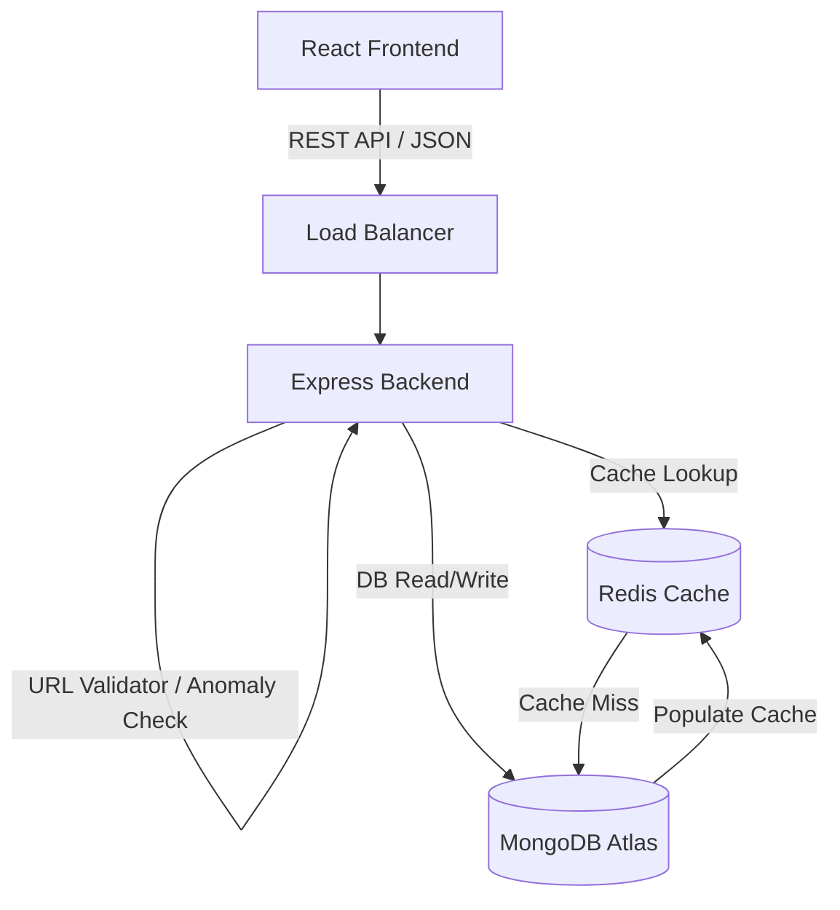
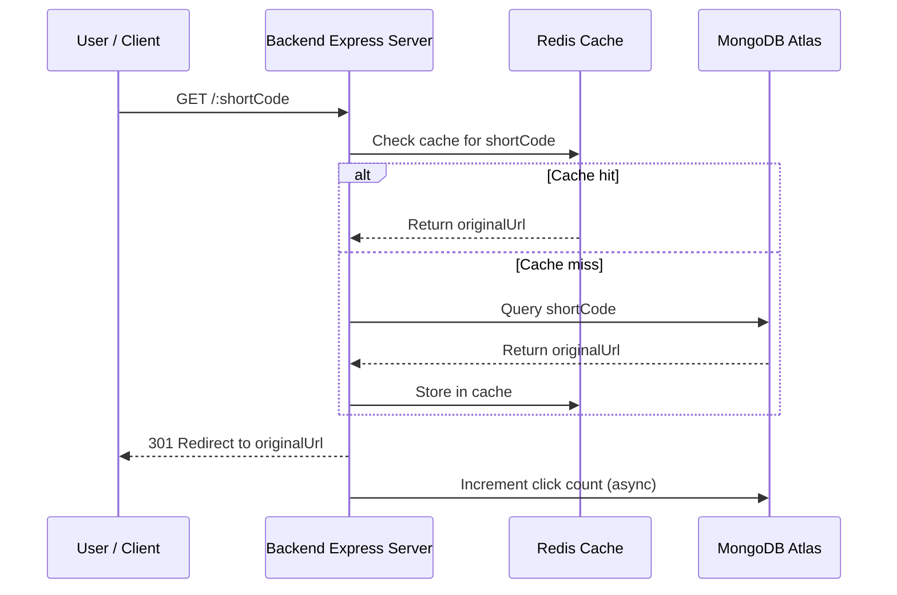
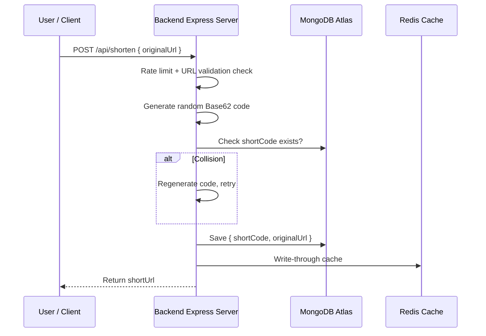

# 🔗 SwiftURL — High Performance URL Shortener

A full-stack, production-style URL shortener built from scratch with **React (Vite)**, **Node.js / Express**, **MongoDB Atlas**, and **Redis Cache**.

Short codes are generated using random **Base62 strings** (`0-9a-zA-Z`) with automated database collision protection, rate limiting, and anomaly detection.

---

## 📐 Architecture & System Flow

### 1. System Architecture



### 2. Redirect Flow Sequence (`GET /:shortCode`)



### 3. Link Creation Sequence (`POST /api/shorten`)



---

## ⚡ Features

- **Random Base62 Short Codes**: Cryptographically strong randomness via `crypto.randomInt` over `0-9a-zA-Z` ($62^7 \approx 3.5$ trillion combinations).
- **Redis Cache Layer**: Instantaneous HTTP 301 redirects from memory, with direct MongoDB fallback if Redis is offline.
- **Asynchronous Click Analytics**: Non-blocking database click count increments that do not slow down redirect speeds.
- **Security & Anomaly Detection**: Rejects invalid schemes, blocks self-referencing redirect loops, and flags suspicious domain patterns.
- **Rate Limiting**: Configured `express-rate-limit` middleware on shorten and redirect routes to prevent abuse.
- **Modern Glassmorphic UI**: Built with React, featuring live click counters, copy-to-clipboard, search filtering, and sortable dashboards.

---

## 🛠️ API Reference

| Method | Endpoint | Description |
| :--- | :--- | :--- |
| `POST` | `/api/shorten` | Shortens long URL. Body: `{ "originalUrl": "https://example.com" }` |
| `GET` | `/:code` | Permanent HTTP 301 redirect to original URL |
| `GET` | `/api/stats/:code` | Returns click counts, creation date, and security status |
| `GET` | `/api/urls?sort=newest\|clicks` | Returns list of all shortened URLs |

---

## 🚀 Quick Start Guide

### Prerequisites
- Node.js (v18+)
- MongoDB (local or MongoDB Atlas connection string)
- Redis (optional local `redis-server` or Upstash instance — app runs gracefully without Redis)

### 1. Clone & Setup Backend

```bash
cd backend
npm install
cp .env.example .env
```

Edit `backend/.env` if using a remote MongoDB or Redis instance:
```env
PORT=5000
MONGO_URI=mongodb://127.0.0.1:27017/url_shortener
REDIS_URL=redis://127.0.0.1:6379
BASE_URL=http://localhost:5000
```

Start the backend dev server:
```bash
npm run dev
```

### 2. Setup Frontend

Open a new terminal:
```bash
cd frontend
npm install
cp .env.example .env
npm run dev
```

Visit **http://localhost:5173** in your browser!

---

## 📈 Scaling Strategy (Production System Design)

1. **Read-Heavy Caching**: Over 95% of traffic in URL shorteners consists of redirect reads (`GET /:code`). Caching all hot links in Redis reduces MongoDB load by over 90%.
2. **MongoDB Replica Sets**: Deploy 1 Primary node for writes and multiple Secondary read-replicas. Read queries for cache misses route to read-replicas.
3. **Database Sharding by `shortCode`**: Partition database records across multiple database nodes based on hash ranges of `shortCode`.
