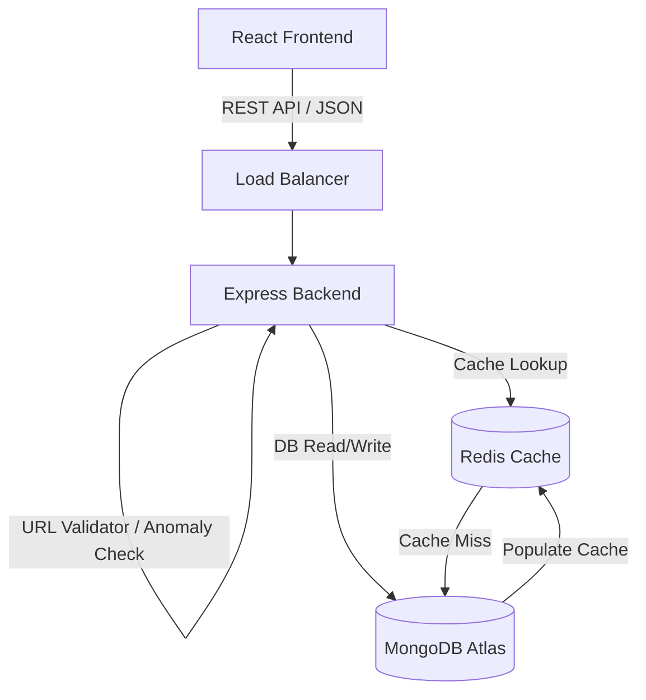
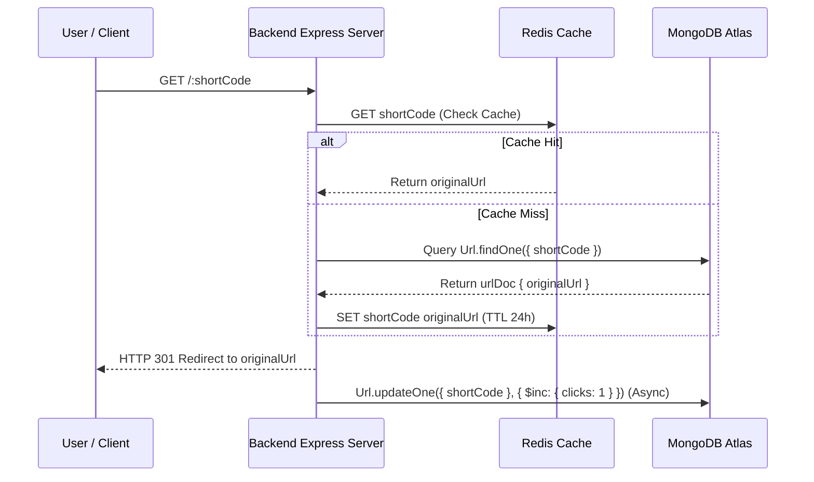
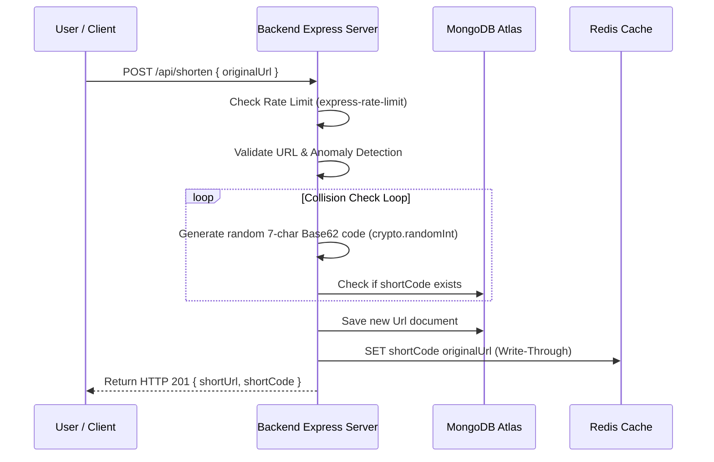

# System Architecture & Technical Specifications

This document details the architecture, request lifecycles, and sequence flows for the **Base62 URL Shortener Service**.

---

## 1. System Architecture Diagram

---

## 2. Sequence Diagram: Redirect Path (`GET /:shortCode`)

The redirect path is optimized for extreme throughput using an in-memory Redis cache layer. The database increment is executed asynchronously to avoid blocking the HTTP 301 response.

---

## 3. Sequence Diagram: Link Creation Path (`POST /api/shorten`)

When shortening a new URL, the backend validates the URL scheme, runs an anomaly check, generates a Base62 random short code, handles collision retries, and writes to both MongoDB and Redis simultaneously (write-through cache).

---

## 4. Architectural Deep Dive & System Design

### A. Base62 Random Generation vs Counter Hash
- **Character Set**: 62 characters (`0-9a-zA-Z`).
- **Code Length**: 7 characters.
- **Keyspace**: $62^7 \approx 3.52 \times 10^{12}$ (over 3.5 trillion unique combinations).
- **Unpredictability**: Using Node's `crypto.randomInt`, short codes are cryptographically unpredictable (unlike sequential auto-incrementing integer IDs which are vulnerable to enumeration attacks).

### B. High-Concurrency Caching Strategy
- **Read-Heavy Ratio**: URL shorteners experience a 100:1 read-to-write ratio.
- **Redis TTL**: Keys are cached for 24 hours (`EX 86400`).
- **Graceful Fallback**: If Redis becomes unreachable, backend seamlessly routes lookups to MongoDB Atlas without failing HTTP requests.

### C. Database Scaling Strategy at Scale
1. **Read Replicas**: Separate primary database node for writes (`POST /api/shorten`) and read-replicas for cache misses on redirects.
2. **Range Sharding by `shortCode`**: Partition MongoDB clusters by initial character range (`0-9`, `a-z`, `A-Z`).
